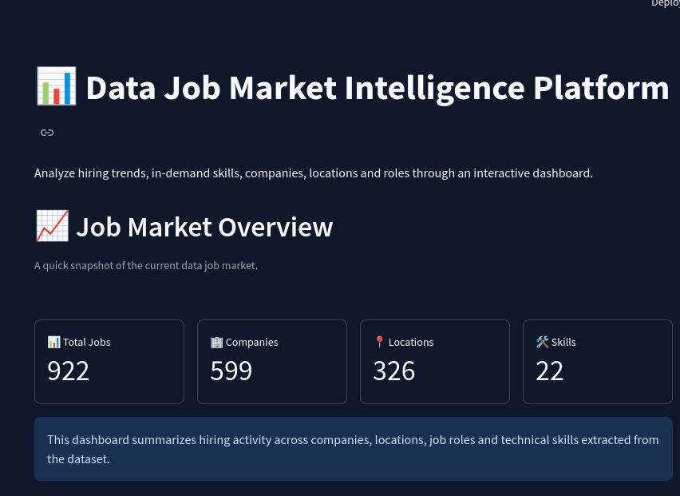
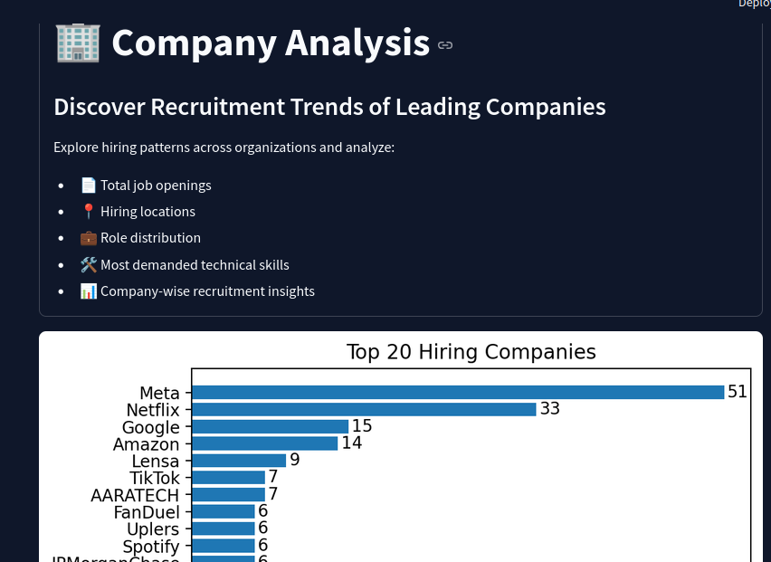
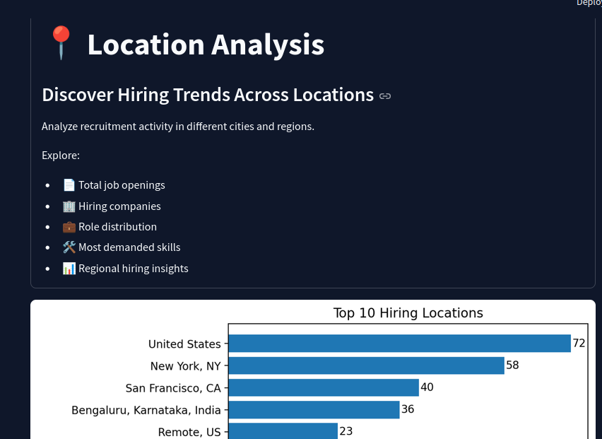
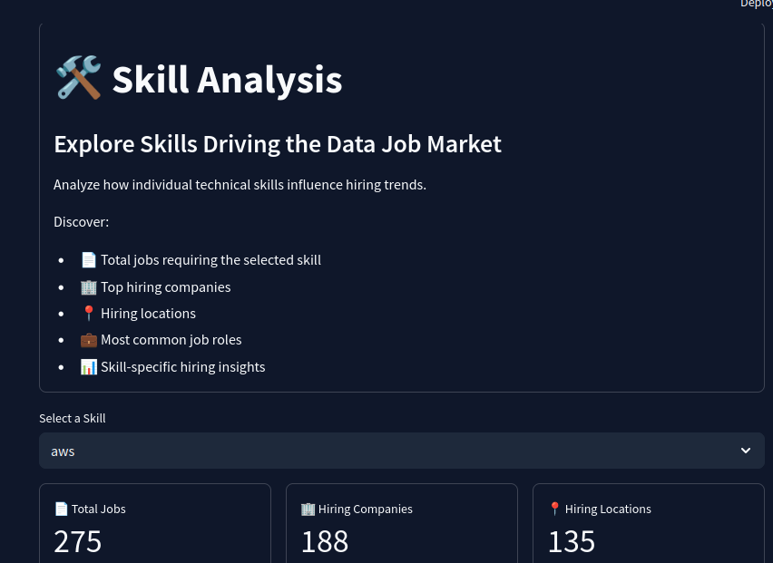
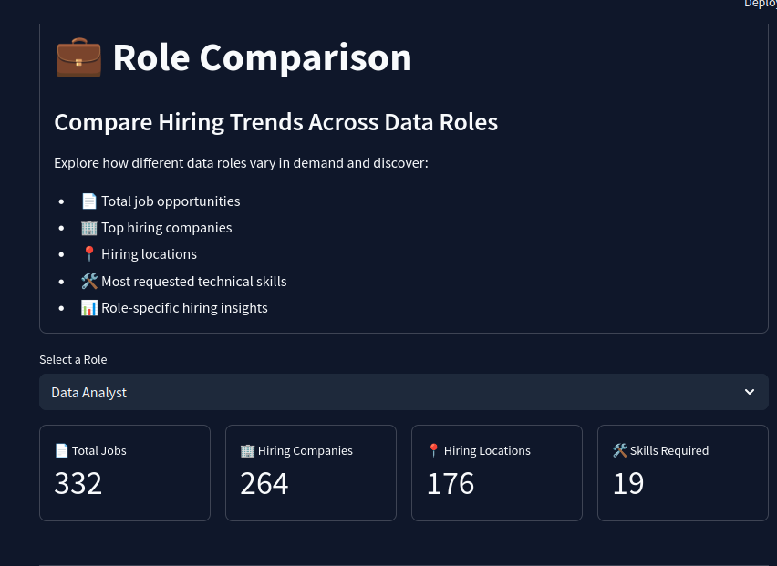

# 📊 Data Job Market Intelligence Platform

An interactive data analytics dashboard built using **Python**, **Pandas**, **Matplotlib**, and **Streamlit** to explore current trends in the data job market.

The project transforms raw job posting data into actionable insights through data cleaning, preprocessing, skill extraction, role classification, exploratory data analysis (EDA), and an interactive dashboard.

It enables users to explore hiring trends, compare job roles, analyze companies and locations, discover in-demand technical skills, and gain meaningful insights from real-world job postings.

## ✨ Features

### 📊 Interactive Analytics Dashboard
- Explore real-time insights from data job postings.
- View key hiring metrics at a glance.
- Interactive visualizations powered by Streamlit.

### 🏢 Company Analysis
- Analyze hiring trends of top recruiting companies.
- Explore role distribution within each company.
- Discover the most demanded skills by company.
- View company-specific job listings and insights.

### 📍 Location Analysis
- Compare hiring activity across different locations.
- Identify top hiring cities and regions.
- Analyze location-wise role distribution.
- Discover location-specific skill demand.

### 🛠️ Skill Analysis
- Explore the most in-demand technical skills.
- Search and analyze individual skills.
- View companies actively hiring for a selected skill.
- Understand role demand associated with each skill.

### 💼 Role Comparison
- Compare different data-related job roles.
- Analyze role-wise hiring trends.
- Discover the skills required for each role.
- Explore role-specific job opportunities.

### 🔄 Data Processing Pipeline
- Data Cleaning & Preprocessing
- Skill Extraction
- Role Classification
- Exploratory Data Analysis (EDA)
- Interactive Dashboard Development

## 🔄 Project Workflow

The project follows a complete end-to-end data analytics pipeline, transforming raw job posting data into meaningful insights through preprocessing, feature engineering, and interactive visualization.

```text
📄 Original Job Dataset
          │
          ▼
🧹 Data Cleaning & Preprocessing
• Remove duplicates
• Handle missing values
• Clean job descriptions
          │
          ▼
🛠️ Skill Extraction
• Extract technical skills
• Standardize skill names
          │
          ▼
💼 Role Classification
• Categorize jobs into:
  - Data Analyst
  - Data Scientist
  - Data Engineer
  - Business Analyst
  - Other
          │
          ▼
📊 Exploratory Data Analysis (EDA)
• Company Analysis
• Location Analysis
• Skill Analysis
• Role Analysis
          │
          ▼
🌐 Interactive Streamlit Dashboard
• Dashboard
• Company Analysis
• Location Analysis
• Skill Analysis
• Role Comparison
```
## 🛠️ Technology Stack

### Programming Language


### Data Analysis & Processing


### Data Visualization


### Dashboard


### Development Environment


### Version Control


## 📸 Dashboard Preview

### 🏠 Dashboard



---

### 🏢 Company Analysis



---

### 📍 Location Analysis



---

### 🛠️ Skill Analysis



---

### 💼 Role Comparison



## 📁 Project Structure

```text
Data-Job-Market-Intelligence-Platform/
│
├── app.py                      # Main Streamlit application
├── README.md                   # Project documentation
├── requirements.txt            # Project dependencies
├── .gitignore                  # Files ignored by Git
│
├── data/
│   ├── original_jobs.csv       # Raw dataset
│   ├── cleaned_jobs.csv        # Cleaned dataset
│   └── processed_jobs.csv      # Final dataset used by the dashboard
│
├── notebooks/
│   └── EDA.ipynb               # Data cleaning, preprocessing & EDA
│
└── images/
    ├── dashboard.png
    ├── company_analysis.png
    ├── location_analysis.png
    ├── skill_analysis.png
    └── role_comparison.png
```
## 📂 Dataset

### 📌 Source

The dataset used in this project was obtained from **Kaggle** and contains real-world data job postings collected from multiple hiring platforms.

### 📊 Final Dataset Summary

- 📄 **Total Job Postings:** 922
- 🏢 Company Information
- 📍 Hiring Locations
- 💼 Job Titles
- 📅 Posting Dates
- 📝 Job Descriptions
- 🛠️ Extracted Technical Skills
- 🎯 Classified Job Roles

### 🔄 Data Processing Pipeline

The raw dataset was transformed into a production-ready dataset through several preprocessing steps:

- Removed duplicate job postings.
- Handled missing and inconsistent values.
- Cleaned and standardized job descriptions.
- Extracted technical skills from job descriptions.
- Classified job postings into predefined data-related roles.
- Created a final processed dataset optimized for interactive analytics.

### 📁 Dataset Files

| File | Description |
|------|-------------|
| `original_jobs.csv` | Raw dataset collected from Kaggle |
| `cleaned_jobs.csv` | Dataset after cleaning and preprocessing |
| `processed_jobs.csv` | Final dataset used by the Streamlit dashboard |

## 🚀 Installation & Usage

### 1️⃣ Clone the Repository

```bash
git clone https://github.com/<your-github-username>/Data-Job-Market-Intelligence-Platform.git
```

### 2️⃣ Navigate to the Project Directory

```bash
cd Data-Job-Market-Intelligence-Platform
```

### 3️⃣ Install Dependencies

```bash
pip install -r requirements.txt
```

### 4️⃣ Run the Streamlit Application

```bash
streamlit run app.py
```

### 5️⃣ Open in Your Browser

The application will be available at:

```
http://localhost:8501
```
## 🔮 Future Enhancements

The project can be extended with several advanced features to provide deeper job market intelligence:

- 🤖 **AI-powered Job Recommendation System** based on user skills.
- 💰 **Salary Trend Analysis** across companies, roles, and locations.
- 🌍 **Interactive Geographic Maps** for visualizing hiring distribution.
- 📈 **Historical Trend Analysis** to compare hiring demand over time.
- 🔄 **Real-time Job Data Collection** through automated web scraping and APIs.
- 📄 **Export Dashboard Reports** in PDF and Excel formats.
- 📊 **Advanced Filtering** based on experience level, employment type, and industry.
- ☁️ **Cloud Deployment** with continuous integration and automated updates.

## 👨‍💻 Author

**Shailaja Durgam**

- 🎓 B.Tech – Electronics & Communication Engineering
- 🏫 Rajiv Gandhi University of Knowledge Technologies (RGUKT), Basar
- 💼 Aspiring Data Analyst | Data Scientist | AI/ML Engineer

---

⭐ If you found this project interesting, consider giving it a star!